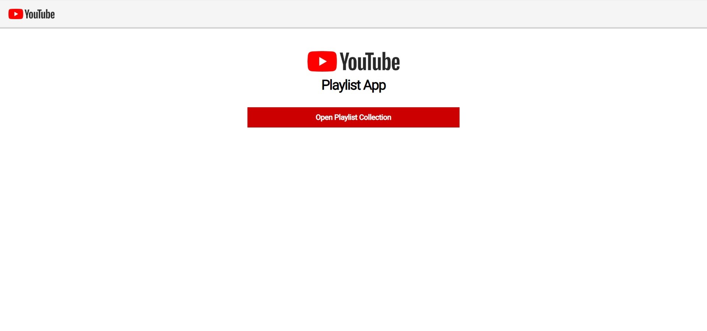
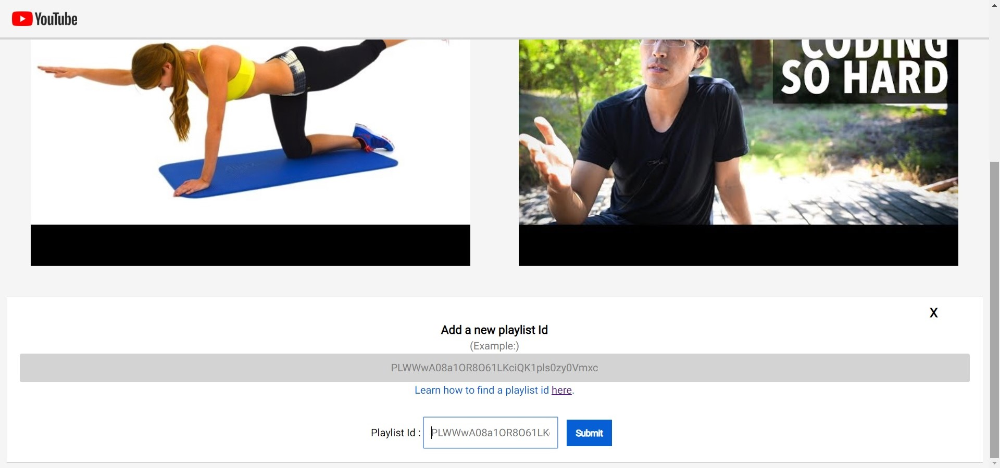
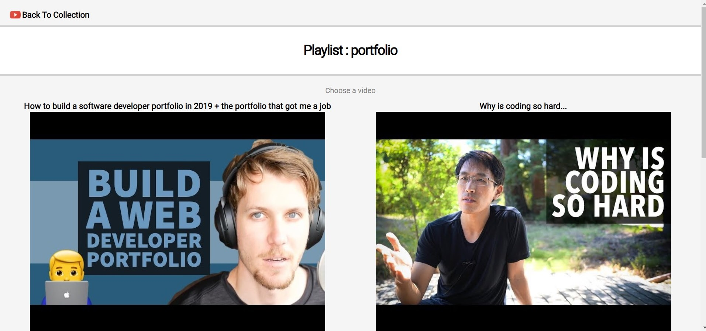
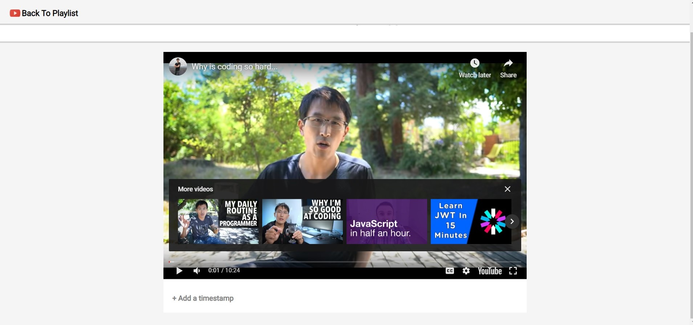
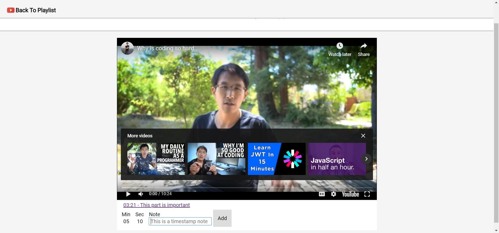
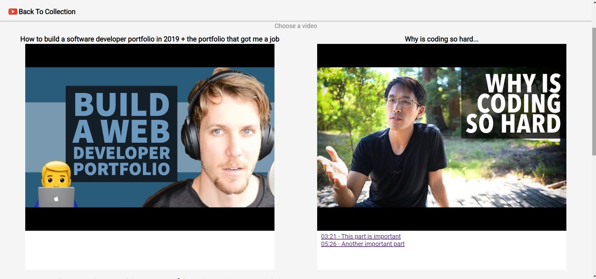

YouTube App

An application that can save multiple YouTube playlists. The user can playlists and timestmps with comments to each video.
[SEE IT LIVE](https://andreadesiderio.github.io/youtube-app/)

##Stack
+ Html
+ Css
+ Javascript
+ Jquery
---

##Motivation
I wanted a place to save timestamps for videos without having to post them on the actual YouTube website. 
---

##Screenshots

Landing Page

Saved playlists

Form section to add a playlist

Single playlist page

Video section

Form section to add a timstamp

Timestapms save in the single playlist section as well

